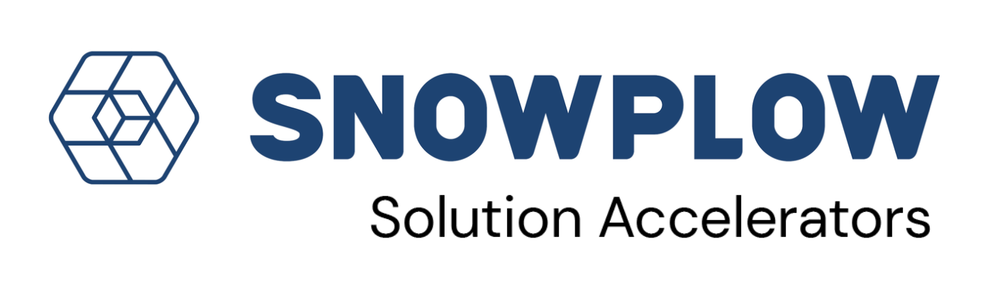

# Real-time Editorial Analytics with Snowplow and Clickhouse

[![License][license-image]][license]

This application is a Snowplow solution accelerator showcasing real-time user behavior analytics using Snowplow event tracking and integrated with Clickhouse using event forwarding.

The application consists of a example Media Publisher website written in Next.js with online news articles and advertisements.

It's intended to be used as part of the [Snowplow Real-time Editorial Analytics accelerator](https://docs.snowplow.io/tutorials/realtime-editorial-analytics-clickhouse/introduction). Check out the accelerator for information on running the project, and to learn more about Snowplow's features and capabilities.

It incorporates Snowplow tracking using these features:
* [Snowplow browser tracker](https://docs.snowplow.io/docs/sources/trackers/web-trackers/)
* [Snowtype](https://docs.snowplow.io/docs/event-studio/snowtype/) event definitions
* [Micro](https://docs.snowplow.io/docs/testing/snowplow-micro/) for local debugging and testing
* [Event Forwarding](https://docs.snowplow.io/docs/destinations/forwarding-events/) to [Clickhouse Cloud](https://clickhouse.com/cloud)

## Copyright and license

Real-time Editorial Analytics with Snowplow and Clickhouse is copyright 2025-present Snowplow Analytics Ltd.

Licensed under the [Apache License, Version 2.0][license] (the "License");
you may not use this software except in compliance with the License.

Unless required by applicable law or agreed to in writing, software
distributed under the License is distributed on an "AS IS" BASIS,
WITHOUT WARRANTIES OR CONDITIONS OF ANY KIND, either express or implied.
See the License for the specific language governing permissions and
limitations under the License.

[license]: https://www.apache.org/licenses/LICENSE-2.0
[license-image]: https://img.shields.io/github/license/snowplow/snowplow-android-tracker